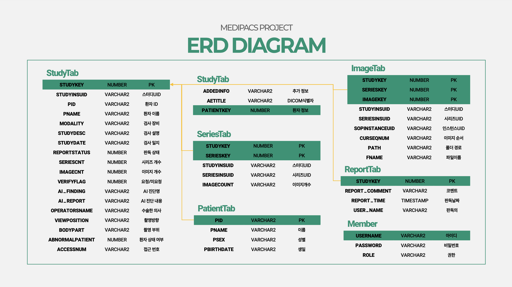
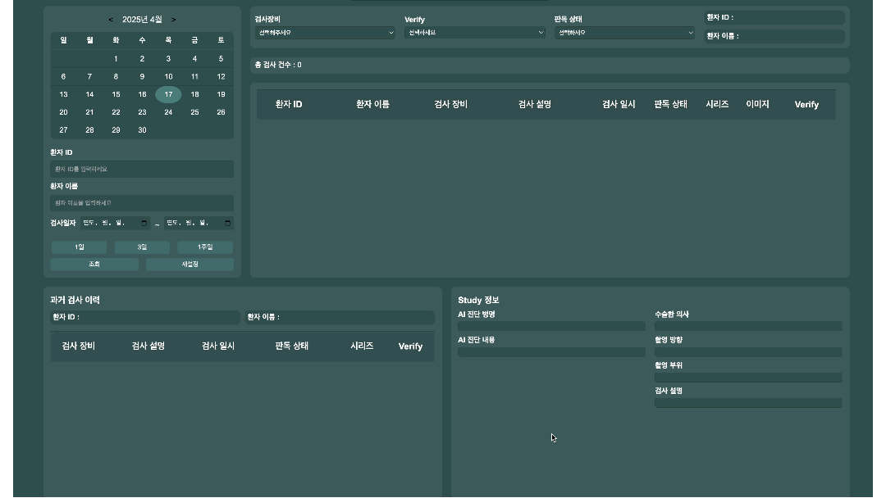
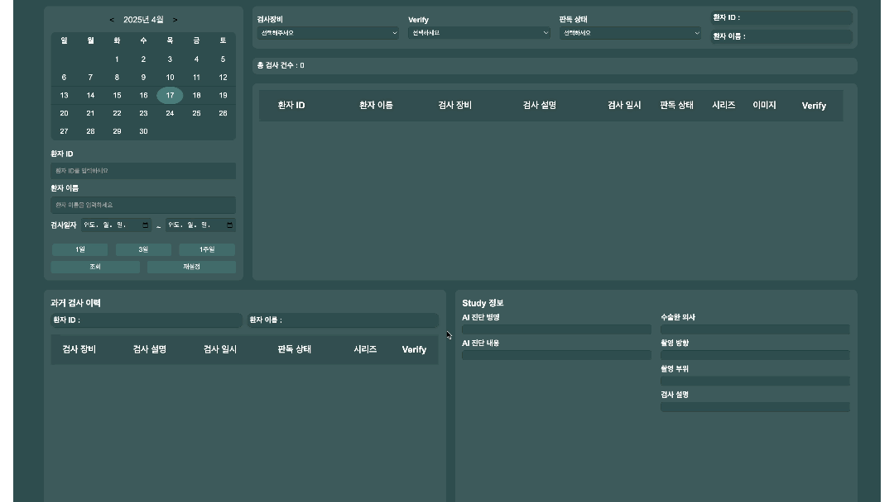
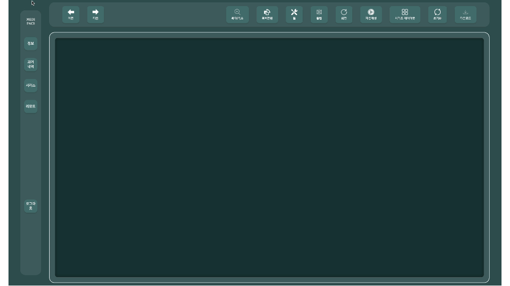

# 🧬 Medipacs - 의료 영상 통합 뷰어

> 의료 검사 기록 및 시리즈 이미지를  
> **직관적이고 편리하게 확인할 수 있는 웹 기반 뷰어 서비스**

---

## 📌 목차

1. [📃 프로젝트 소개](#-프로젝트-소개)  
2. [📅 제작 기간](#-제작-기간)  
3. [🧑‍💻 팀원 구성](#-팀원-구성)  
4. [🚀 사용 기술 스택](#-사용-기술-스택)  
5. [📊 프로젝트 설계 포인트](#-프로젝트-설계-포인트)
6. [📐 ERD 구조도](#-erd-구조도)   
7. [🖥️ 주요 기능 소개](#️-주요-기능-소개)  
   - [1. 로그인 / 회원가입](#1-로그인--회원가입)  
   - [2. 📺 메인 페이지](#-메인-페이지-주요-기능)  
   - [3. 상세 페이지 (의료 이미지 뷰어)](#3-상세-페이지-의료-이미지-뷰어)  
8. [✅ 프로젝트의 장점](#-프로젝트의-장점)  
9. [💬 마무리](#-마무리)

---

## 📃 프로젝트 소개

**Medipacs**는 의료진이 환자의 검사 기록과 DICOM 시리즈 이미지를  
웹 환경에서 효율적으로 조회하고 분석할 수 있도록 지원하는 시스템입니다.

- 직관적인 UI로 빠른 정보 탐색 가능  
- Cornerstone 기반 의료 영상 분석 기능  
- Spring Security 기반 권한별 접근 제어

---

## 📅 제작 기간

> **2024.10.07 ~ 2024.11.15**

---

## 🧑‍💻 팀원 구성

| 이름     | 담당 역할         |
|----------|-------------------|
| 강민석   | Backend 개발       |
| 김효빈   | Frontend 개발      |
| 최서진   | Backend 개발       |
| 김현규   | 보안 및 인증 관리   |
| 진현서   | Frontend 개발      |

---

## 🚀 사용 기술 스택

- **Frontend**: Thymeleaf, JavaScript, HTML, CSS  
- **Backend**: Java, Spring Boot, Spring Security, JPA  
- **Database**: Oracle  
- **의료 뷰어**: Cornerstone.js  
- **Tooling**: SQL Developer, VS Code, Git

---

## 📊 프로젝트 설계 포인트

- Spring Security를 활용한 인증 및 역할 기반 접근 제어  
- JPA와 MyBatis를 병행 사용하여 복잡한 쿼리 유연하게 처리  
- DTO, Entity, Service, Controller 간 계층 분리로 유지보수성 향상  
- Thymeleaf 기반 SSR 템플릿으로 빠른 페이지 렌더링  
- Oracle DB 연동으로 검사·환자 정보의 안정적인 조회 및 저장  
- 다중 조건 검색 및 비동기 처리로 실시간 필터링 구현

---
### 📐 ERD 구조도

> 📊 데이터베이스 테이블 간의 관계를 표현한 ERD 구조도입니다.  
> 검사 정보, 환자 정보, 사용자 계정 간의 관계를 명확히 하여  
> 기능별 데이터 흐름을 설계했습니다.

---

## 🖥️ 주요 기능 소개

### 1. 로그인 / 회원가입

- 사용자 인증 및 역할별 권한 분리  
- 인증되지 않은 사용자는 `/login` 페이지로 리다이렉트  
- 로그인 시 사용자 정보는 세션에 저장됨  

> 🔐 Spring Security 기반 로그인 구현  
> 

---

### 📺 메인 페이지 주요 기능

- 환자 ID, 이름, 검사일자, 장비, 판독 상태 등 **복합 검색 기능** 제공  
- 검사 리스트에서 **시리즈별 이미지 및 Verify 기능** 수행  
- 검사 결과에 대한 **AI 진단 메타 정보 확인 가능**  
- **DICOM 및 이미지 다운로드 기능 포함**

> 📄 검사 리스트 및 검색 기능  
>   
> ☑️ **날짜 기반 검색**  
> 달력 UI를 통해 특정 날짜 또는 기간 지정 후 검사 기록 조회

>   
> ☑️ **조건 기반 검색**  
> 환자 ID, 이름, 장비, 판독 상태 등 다양한 조건 조합 필터링 지원

---

### 3. 상세 페이지 (의료 이미지 뷰어)

- 검사 상세 정보와 시리즈 썸네일 표시  
- Cornerstone.js 기반 의료 영상 렌더링  
- 확대/축소, 회전, 윈도우 레벨 조절 등 주요 기능 포함  

> 🖼 DICOM 시리즈 이미지 뷰어  

>   
> ☑️ **탭 기반 정보 확인**  
> 사이드 메뉴를 통해 다음 항목을 전환 확인:
> - **정보**: 검사 상세 정보  
> - **과거 내역**: 이전 검사 기록 조회  
> - **시리즈**: 시리즈별 이미지 리스트  
> - **리포트**: AI 진단, 촬영 방향 등 보고서

---

>   
> ☑️ **DICOM 이미지 뷰어 & 다운로드**  
> - Cornerstone 기반 영상 조작 기능  
> - DICOM 이미지 및 전체 시리즈 다운로드 가능

---

>   
> ☑️ **리포트 저장 및 삭제 기능**  
> - AI 진단 내용을 수정 후 저장  
> - 불필요한 리포트는 삭제 가능

---

## ✅ 프로젝트의 장점

- **UI/UX**: 의료진이 빠르게 탐색하고 사용할 수 있는 정보 배치  
- **확장성**: PACS 시스템 연동 및 병원 내 서비스 확장 가능  
- **보안성**: Spring Security로 역할별 권한 관리 및 접근 통제

---

## 💬 마무리

> Medipacs는 의료 현장에서  
> **검사 데이터 확인과 영상 판독을 웹에서 가능하게 만든 시스템**입니다.  
> 팀원 간의 유기적인 협업을 통해 설계된 이 플랫폼은  
> 다양한 병원 환경에서도 쉽게 적용될 수 있는 구조를 가지고 있습니다.

---

<strong>🧑‍⚕️ 감사합니다! Medipacs 팀입니다.</strong>

