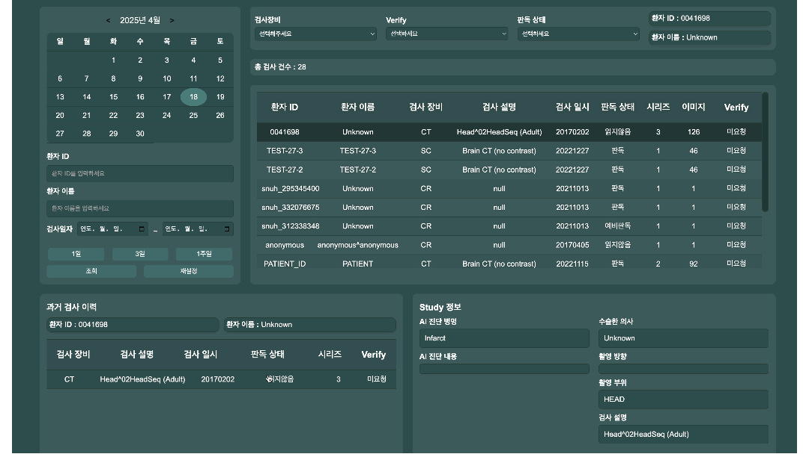

# 🧬 Medipacs - 의료 영상 통합 뷰어

> 의료 검사 기록 및 시리즈 이미지를  
> **직관적이고 편리하게 확인할 수 있는 웹 기반 뷰어 서비스**

---

## 📃 프로젝트 소개

Medipacs는 의료진이 환자의 검사 기록과 DICOM 시리즈 이미지를  
웹에서 효율적으로 조회하고 분석할 수 있도록 지원하는 시스템입니다.

- 직관적인 UI로 빠른 정보 탐색 가능  
- Cornerstone 뷰어 기반 이미지 분석 기능  
- Spring Security를 이용한 권한 기반 접근 제어

---

## 📅 제작 기간

> **2024.10.07 ~ 2024.11.15**

---

## 🧑‍💻 팀원 구성

| 이름     | 담당 역할        |
|----------|------------------|
| 강민석   | Backend 개발     |
| 김효빈   | Frontend 개발    |
| 최서진   | Backend 개발     |
| 김현규   | 보안 및 인증 관리   |
| 진현서     |Frontend 개발     |

---

## 🚀 사용 기술 스택

- **Frontend**: Thymeleaf, JavaScript, HTML, CSS  
- **Backend**: Java, Spring Boot, Spring Security, JPA  
- **Database**: Oracle  
- **의료 뷰어**: Cornerstone.js  
- **Tooling**: SQL Developer, VS Code, Git

---

## 📊 프로젝트 설계 포인트

- Spring Security를 활용한 사용자 인증 및 권한 기반 접근 제어 구현
- JPA와 MyBatis를 함께 사용하여 유연한 데이터 처리 및 복잡한 쿼리 대응
- DTO, Entity, Service, Controller 간 계층 분리를 통한 유지보수성 향상
- Thymeleaf를 활용한 템플릿 기반 프론트 구성으로 빠른 서버 렌더링 구현
- Oracle DB와의 연동을 통해 검사 및 환자 정보를 효율적으로 저장 및 조회
- 의료 데이터 처리 특성에 맞춘 비동기 요청 처리 및 다중 조건 검색 기능 설계

---

## 🖥️ 주요 기능 소개

### 1. 로그인 / 회원가입

- 사용자 인증 및 역할별 권한 분리
- 인증되지 않은 사용자 접근 시 `/login`으로 이동
- 로그인 성공 시 세션에 사용자 정보 저장

> 🔐 Spring Security 기반 로그인 구현  
> 

---

### 📺 메인 페이지 주요 기능

- 환자 ID, 이름, 검사일자, 장비, 판독 상태 등 **다중 조건 검색** 기능 제공  
- 검색된 검사 리스트에서 **시리즈 이미지 확인 및 Verify 실행** 가능  
- 검사 결과에 대한 **AI 진단 병명, 진단 내용, 촬영 방향 등 메타 정보** 제공  
- **DICOM 및 이미지 다운로드**를 통한 검사 파일 저장 기능 포함

> 📄 검사 리스트 및 검색 기능  
>   
> ☑️ **날짜 기반 검색**  
> 사용자는 원하는 날짜 또는 기간을 달력 UI를 통해 지정하여, 해당 기간 내의 모든 검사 기록을 빠르게 조회할 수 있습니다.

>   
> ☑️ **조건 기반 검색**  
> 환자 ID, 이름, 검사 장비, 판독 상태, Verify 여부 등 다양한 조건을 조합해 **정밀한 필터링**이 가능합니다.

---

### 3. 상세 페이지 (의료 이미지 뷰어)

- 검사 상세 정보 + 시리즈별 이미지 미리보기
- Cornerstone.js를 이용한 의료 이미지 렌더링
- 확대/축소, 윈도우 레벨 조정 등 기본 뷰어 기능 포함

> 🖼 DICOM 시리즈 이미지 뷰어  

>   
> ☑️ **탭 기반 정보 확인**  
> 화면 좌측의 사이드 메뉴를 통해 아래 항목들을 탭 전환하며 확인할 수 있습니다:
> - **정보**: 기본 검사 정보 (검사일, 장비 등)
> - **과거 내역**: 동일 환자의 과거 검사 기록 조회
> - **시리즈**: 시리즈별 이미지 그룹 선택
> - **리포트**: AI 진단 정보, 수술 부위, 촬영 방향 등 상세 보고서 확인 가능

---

>   
> ☑️ **DICOM 이미지 뷰어 & 다운로드 기능**  
> - Cornerstone 기반으로 이미지 확대, 축소, 회전, 윈도우 레벨 조정 등 제공  
> - **DICOM 이미지 및 시리즈 전체 다운로드 가능**  

---

>   
> ☑️ **리포트 저장 및 삭제 기능**  
> - 리포트 탭에서 AI 진단 내용을 직접 수정한 후 **저장**  
> - 저장된 리포트는 필요 시 **삭제**도 가능  

---

## ✅ 프로젝트의 장점

- **UI/UX**: 의료진 입장에서 효율적인 정보 조회 설계
- **확장성**: 추후 PACS 연동, 병원 시스템 연계 가능 구조
- **보안성**: 민감한 의료 데이터 보호를 위한 접근 통제 구현
---

## 💬 마무리

> Medipacs는 의료 현장에서 진짜 필요한  
> **검사 데이터 확인과 이미지 분석을 웹에서 가능하게 만든 시스템**입니다.  
> 팀원들의 역할 분담과 협업을 통해 구현된 이 뷰어는  
> 앞으로 다양한 의료 환경에 적용될 수 있는 가능성을 가집니다.

---

<strong>🧑‍⚕️ 감사합니다! Medipacs 팀입니다.</strong>

